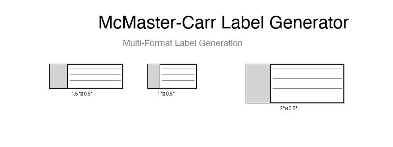
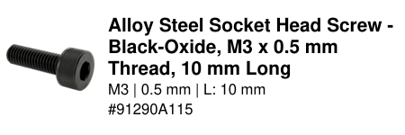
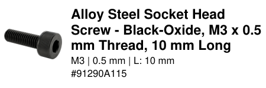
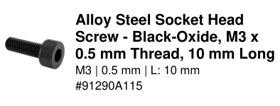
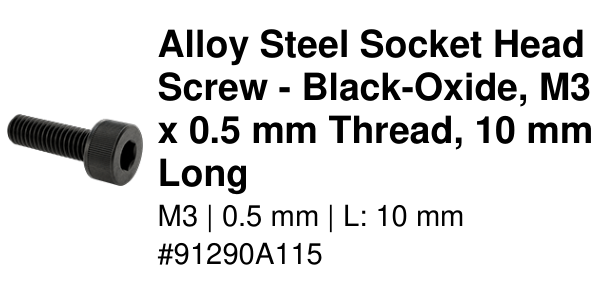

# McMaster-Carr Label Generator 🏷️

Generate professional labels for McMaster-Carr parts with automatic product information retrieval. Perfect for organizing parts bins, inventory management, and workshop organization.



## ✨ Features

- **🔐 Secure API Integration** - Certificate-based authentication with McMaster-Carr
- **💾 Smart Caching** - Reduces API calls by caching product data locally
- **📐 Flexible Dimensions** - Any label size with support for inches, millimeters, and more
- **🖼️ Multiple Formats** - Export to PDF, PNG, JPG, and other common formats
- **🎯 High Resolution** - Configurable DPI for crisp printing (72-2400 DPI)
- **📝 Auto Layout** - Smart text sizing with vertical centering and no clipping
- **⚡ Batch Processing** - Generate multiple labels at once
- **🔒 Secure Credentials** - No hardcoded passwords, uses environment variables or prompts
- **🎨 Advanced Sorting** - Visual similarity, alphabetical, and intelligent fuzzy text sorting
- **🔍 Smart Categorization** - Automatically groups fasteners, hardware, and materials
- **📊 Dimension-Aware** - Sorts by thread size, length with proper unit handling (M4 < M10)

## 📸 Sample Outputs

<table>
<tr>
<td><br><i>Standard 1.5" × 0.5" label</i></td>
<td><br><i>Large 3" × 1" label with more detail</i></td>
</tr>
<tr>
<td><br><i>Address label size (2.625" × 1")</i></td>
<td><br><i>Shipping label size (4" × 2")</i></td>
</tr>
</table>

## 🚀 Quick Start

### Prerequisites
- Python 3.8+
- McMaster-Carr API access and certificate (`.pfx` file)

### Installation

```bash
# Clone the repository
git clone https://github.com/yourusername/mcmaster-label-generator.git
cd mcmaster-label-generator

# Install dependencies
pip install -r requirements.txt

# Add your certificate
cp /path/to/your/certificate.pfx cert/
```

### Basic Usage

```bash
# Generate a label for a single part
python -m src.main 91290A115

# Multiple parts
python -m src.main 91290A115 91290A116 91290A117

# The app will prompt for credentials on first run:
# McMaster-Carr API Username (email): your-email@example.com
# McMaster-Carr API Password: ********
# Certificate Password: ********
#
# ✓ Credentials are securely saved - no prompts on future runs!
```

### 🚀 Best Practices Example

```bash
# Generate organized labels for a hardware collection
# This example shows the recommended way to process multiple parts:

# 1. Create a parts list with comments
cat > hardware_inventory.txt << 'EOF'
# Screws
92196A540  # M4 Socket Head Cap Screw
92196A542  # 1/4-20 Socket Head Cap Screw
92949A550  # 1/4-20 Button Head Screw

# Nuts
91845A029  # 1/4-20 Hex Nut
94804A029  # 1/4-20 Nylon Lock Nut

# Washers  
92141A029  # 1/4" Flat Washer
92146A029  # 1/4" Split Lock Washer
EOF

# 2. Generate labels with fuzzy sorting for logical organization
python -m src.main -f hardware_inventory.txt --sort-fuzzy -w 2in -h 0.75in -o hardware-labels.pdf -v

# Result: Labels are organized by category (screws, nuts, washers)
# Within each category, sorted by size (M4 < 1/4-20)
# Material quality considered (316 SS before 18-8 SS)
```

## 📖 Common Use Cases

### 🗄️ Parts Bin Organization
Generate consistent labels for all your parts bins:
```bash
# Create labels for hardware bins
python -m src.main 91290A115 91290A116 91290A117 -o hardware-labels.pdf

# Custom size for small drawers
python -m src.main 91290A115 -w 1in -h 0.5in -o small-bin.png

# Numbers without units default to inches
python -m src.main 91290A115 -w 2 -h 0.75

# Large labels - text and images scale automatically
python -m src.main 91290A115 -w 4 -h 3 -o large-label.pdf
```

### 📦 Inventory Management
Batch process from a parts list:
```bash
# Create a parts list file
cat > inventory.txt << EOF
91290A115  # 1/4-20 Hex Nuts
92196A540  # M4 Socket Screws
9452K36    # O-Rings
EOF

# Generate all labels
python -m src.main -f inventory.txt -o inventory-labels.pdf
```

### 🏭 Workshop Organization
Create durable, high-resolution labels with smart organization:
```bash
# High-res labels for laminating
python -m src.main 5544K13 -o bearing-label.png -r 600 -w 3in -h 1in

# Weather-resistant format
python -m src.main 92196A540 -o screw-label.bmp -w 2in -h 1in

# Organize mixed hardware with fuzzy sorting
# This groups all screws together, then nuts, then washers
# Within each group, sorts by size (M4 before M10, #4 before #10)
python -m src.main 92196A540 91290A115 92949A550 91845A029 --sort-fuzzy -o organized-labels.pdf

# Example fuzzy sort result:
# 1. Socket head screws (316 SS first, then 18-8 SS)
# 2. Button head screws (by thread size)
# 3. Hex nuts (by thread size)
# 4. Washers (by screw size)
```

### 🌍 International Units
Use metric measurements:
```bash
# 50mm × 20mm labels
python -m src.main 91290A115 -w 50mm -h 20mm

# A4 sheet of labels (can be cut)
python -m src.main 91290A115 -w 210mm -h 297mm -o a4-sheet.pdf
```

### 🎨 Advanced Sorting Options
Organize your labels with intelligent sorting:

#### Visual Similarity Sorting
```bash
# Group visually similar parts together
python -m src.main 91290A115 92196A540 91845A029 94804A029 --sort-similar

# Use different visual sorting algorithms
python -m src.main -f parts_list.txt --sort-similar --similarity-method spectral

# Available methods:
# - hierarchical: Clusters similar items (default)
# - spectral: Orders by visual spectrum
# - greedy: Fast nearest-neighbor approach
```

#### Alphabetical Sorting
```bash
# Sort alphabetically by product ID
python -m src.main -f parts_list.txt --sort-text

# Sort by family description
python -m src.main -f parts_list.txt --sort-text --text-field family

# Sort by detailed description
python -m src.main -f parts_list.txt --sort-text --text-field detail
```

#### Intelligent Fuzzy Text Sorting
```bash
# Smart sorting that groups similar items and sorts by dimensions
python -m src.main -f parts_list.txt --sort-fuzzy

# This advanced sorting:
# - Groups similar hardware (all socket screws together, all hex nuts together)
# - Sorts by material quality (316 stainless before 18-8 stainless)
# - Orders by thread size with unit awareness (M4 < M10, #4 < #10, 1/4" < 3/8")
# - Then sorts by length within each group
```

## 🎨 Customization Options

### Label Dimensions
```bash
# Inches (default)
python -m src.main 91290A115 -w 2in -h 1in

# Millimeters
python -m src.main 91290A115 -w 50mm -h 25mm

# Centimeters
python -m src.main 91290A115 -w 5cm -h 2.5cm

# Mix units
python -m src.main 91290A115 -w 2in -h 25mm
```

### Output Formats
```bash
# PDF (vector, perfect for printing)
python -m src.main 91290A115 -o labels.pdf

# PNG (lossless, transparent background)
python -m src.main 91290A115 -o labels.png

# JPEG (smaller file size)
python -m src.main 91290A115 -o labels.jpg

# TIFF (multi-page support)
python -m src.main 91290A115 91290A116 -o labels.tiff
```

### Resolution Settings
```bash
# Screen display (low DPI)
python -m src.main 91290A115 -o display.png -r 72

# Laser printer (default)
python -m src.main 91290A115 -o print.png -r 300

# High quality printing
python -m src.main 91290A115 -o hq-print.png -r 600

# Professional printing
python -m src.main 91290A115 -o pro.png -r 1200
```

## 🔧 Advanced Usage

### Command Line Options
Complete list of available options:
```bash
python -m src.main [OPTIONS] PRODUCT_IDS...

Options:
  -f, --file FILE              Read product IDs from file
  -o, --output FILE            Output filename (default: labels-TIMESTAMP.pdf)
  -w, --width SIZE             Label width (e.g., 1.5in, 50mm, 2.5cm)
  -h, --height SIZE            Label height (e.g., 0.5in, 20mm, 1cm)
  -r, --dpi INTEGER            Resolution in DPI (72-2400, default: 300)
  -v, --verbose                Enable verbose output
  
  # Sorting Options (choose one)
  --sort-similar               Sort by visual similarity
  --sort-text                  Sort alphabetically
  --sort-fuzzy                 Smart sorting with dimension awareness
  
  # Additional Options
  --similarity-method METHOD   Visual sorting algorithm (hierarchical/spectral/greedy)
  --text-field FIELD          Text sort field (product_id/family/detail/description)
  --clear-cache               Clear stored credentials
  --help                      Show help message
```

### Environment Variables
Configure behavior without command line flags:
```bash
# API Credentials
export MCMASTER_API_USERNAME=your-email@example.com
export MCMASTER_API_PASSWORD=your-password
export MCMASTER_CERT_PASSWORD=certificate-password

# Cache Settings
export MCMASTER_PLACEHOLDER_EXPIRY_DAYS=14  # Days before placeholder files expire

# Label Defaults
export MCMASTER_LABEL_WIDTH=1.5
export MCMASTER_LABEL_HEIGHT=0.5

# Certificate Path (if not in default location)
export MCMASTER_CERT_FILENAME=your-cert.pfx

# Now run without prompts
python -m src.main 91290A115
```

### Secure Credential Storage
The app uses your system's secure keychain to store credentials:
- **macOS** - Keychain Access
- **Windows** - Credential Manager
- **Linux** - Secret Service (GNOME Keyring/KWallet)

```bash
# First run - you'll be prompted for credentials
python -m src.main 91290A115

# Future runs - credentials loaded from secure storage, no prompts!
python -m src.main 91290A116

# Clear stored credentials if needed
python -m src.main --clear-cache
```

Label dimensions are remembered across sessions (stored securely).

### Caching and Performance
The system intelligently caches data to minimize API calls:

#### Smart Caching
```bash
# First run - fetches from API
python -m src.main 91290A115 -v
# Output: Product info not in cache for 91290A115, calling API...
# Output: Image not in cache for 91290A115, downloading from API...

# Second run - uses cache
python -m src.main 91290A115 -v
# Output: Using cached product info for 91290A115
# Output: Using cached image for 91290A115

# Cache statistics are shown after batch processing
python -m src.main -f parts_list.txt -v
# Output: === Cache Usage Statistics ===
# Output: Product Info: 45 cache hits, 5 API calls (90.0% cache hit rate)
# Output: Images: 40 cache hits, 10 downloads (80.0% cache hit rate)
```

#### Placeholder System
For products without images or CAD files:
```bash
# System creates placeholders for missing assets
# These expire after 2 weeks (configurable)
python -m src.main 91290A115 -v
# Output: No image URL found for product 91290A115, creating placeholder

# Future runs skip API checks until placeholder expires
python -m src.main 91290A115 -v
# Output: Valid placeholder found - no image available for 91290A115

# Configure placeholder expiry (in days)
export MCMASTER_PLACEHOLDER_EXPIRY_DAYS=7  # Check weekly for updates
```

### Verbose Mode
See detailed processing information:
```bash
python -m src.main 91290A115 -v

# Output:
# Using cached dimensions: 1.50in x 0.50in
# Using default DPI: 300
# Cache hit: Product info for 91290A115
# Cache hit: Image for 91290A115
# Sorting 1 products using enhanced fuzzy text grouping (v4)
# Generated labels PNG: output/labels-20240805-143022.png
```

### SSL Configuration
The app automatically uses your system's trusted CA certificates. For corporate environments:
```bash
# Use custom CA bundle
export SSL_CERT_FILE=/path/to/corporate-ca.crt
export MCMASTER_SSL_VERIFY=true

python -m src.main 91290A115
```

See [docs/CONFIGURATION.md](docs/CONFIGURATION.md) for detailed configuration options.

## 📋 Label Information

Each label includes:
- **Product Image** - Technical drawing or product photo (when available)
- **Description** - Official McMaster-Carr product name
- **Key Specifications** - Important dimensions and specifications
- **Part Number** - McMaster-Carr catalog number for reordering

### 🎯 Smart Dynamic Scaling

The label generator automatically scales content to maximize space usage:
- **Intelligent Text Sizing** - Font sizes adjust based on available space
- **Vertical Centering** - Text is perfectly centered when space allows
- **Proportional Image Scaling** - Product images scale to fit perfectly
- **No Clipping** - Text uses accurate bounding boxes to prevent edge clipping
- **Edge-to-Edge Support** - Text can extend to label edges for maximum space usage
- **Optimized Layout** - Multi-pass optimization for best readability
- **Consistent Layouts** - All raster formats (PNG, JPG, etc.) are generated from PDF to ensure identical layouts across formats

```bash
# Same content adapts to any label size
python -m src.main 91290A115 -w 0.5 -h 0.5 -o tiny.pdf      # Tiny 0.5" label
python -m src.main 91290A115 -w 1.5 -h 0.5 -o standard.pdf  # Standard label
python -m src.main 91290A115 -w 4 -h 3 -o large.pdf        # Large 4"x3" label
```

The layout engine uses multi-pass optimization to find the best font sizes and spacing for your specific label dimensions.

## 🛠️ Installation Details

### System Requirements
- **Python**: 3.8 or higher
- **OS**: Windows, macOS, or Linux
- **Memory**: 512MB RAM minimum
- **Storage**: 100MB for application and cache

### Additional Dependencies
For full format support, you may need:

**macOS**:
```bash
brew install poppler  # For PDF to image conversion
```

**Ubuntu/Debian**:
```bash
sudo apt-get install poppler-utils
```

**Windows**:
Download poppler from [this link](https://blog.alivate.com.au/poppler-windows/)

## 📚 Documentation

- [Setup Guide](docs/SETUP_GUIDE.md) - Detailed installation and configuration
- [API Reference](docs/API_REFERENCE.md) - Complete command reference
- [Performance Guide](docs/PERFORMANCE_OPTIMIZATION_RESULTS.md) - Caching and optimization
- [Image Processing](docs/HIGH_RESOLUTION_IMAGE_IMPROVEMENTS.md) - Image handling details

## 🤝 Contributing

Contributions are welcome! Please feel free to submit a Pull Request. For major changes, please open an issue first to discuss what you would like to change.

## 📄 License

This project is licensed under the GNU General Public License v3.0 - see the [LICENSE](LICENSE) file for details.

## ⚠️ Disclaimer

This tool is not affiliated with or endorsed by McMaster-Carr. Please ensure you comply with McMaster-Carr's API terms of service when using this tool.

## 🙏 Acknowledgments

- McMaster-Carr for providing API access
- The Python community for excellent libraries
- Contributors and users of this tool

---

Made with ❤️ for the maker community